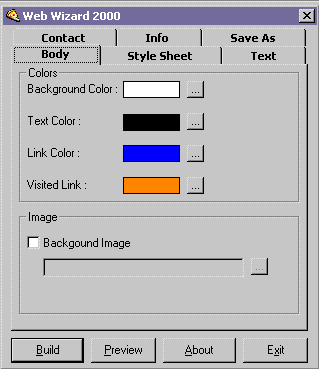



## Web Wizard

### Description

It takes some information from you and then generates a web page based on your given information.Tabbed Kool Interface A must see for those who want to program just like this !
 
### More Info
 
No input

HTML Page

             |
---                |---
**Submitted On**   |2000-10-01 14:36:08
**By**             |[Md Emran Hasan](https://github.com/Planet-Source-Code/PSCIndex/blob/master/ByAuthor/md-emran-hasan.md)
**Level**          |Beginner
**User Rating**    |4.6 (64 globes from 14 users)
**Compatibility**  |VB 4\.0 \(32\-bit\), VB 5\.0, VB 6\.0
**Category**       |[Internet/ HTML](https://github.com/Planet-Source-Code/PSCIndex/blob/master/ByCategory/internet-html__1-34.md)
**World**          |[Visual Basic](https://github.com/Planet-Source-Code/PSCIndex/blob/master/ByWorld/visual-basic.md)
**Archive File**   |[CODE\_UPLOAD103131012000\.zip](https://github.com/Planet-Source-Code/md-emran-hasan-web-wizard__1-11794/archive/master.zip)

